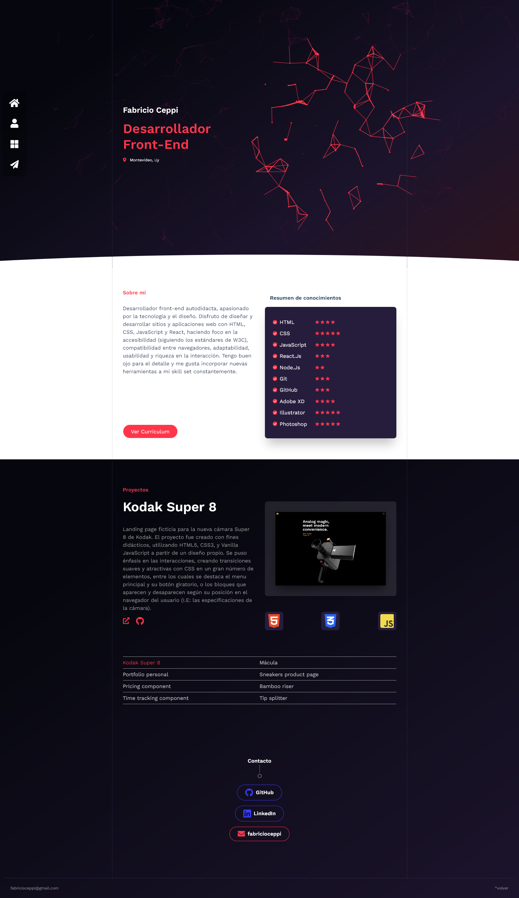
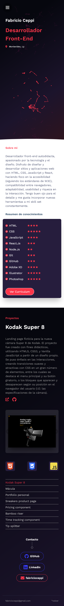

# Fabricio Ceppi | Desarrollador Frontend | Portfolio Personal

Este sitio web (en el que estás navegando) fue diseñado para exhibir mis proyectos personales.
Mi objetivo era crear un sitio fácil de navegar y mantener, visualmente atractivo y amigable con el usuario.
La carga de contenidos se hace sencilla, tan solo modificando el objeto que se encuentra
en data.js pueden agregarse nuevos proyectos y habilidades, o sustituirse completamente para que otro desarrollador despliegue su portfolio fácilmente.
La sección superior contiene una pieza visual interactiva, creada con Canvas y JavaScript (algo con lo que me gusta experimentar).

## Contenidos

  - [Screenshots](#screenshots)
  - [Enlaces](enlaces)
- [Proceso](#proceso)
  - [Creado con](#creado-con)
- [Autor](#autor)

### Screenshots

### Enlaces

- Repositorio: [Repositorio GitHub](https://github.com/fabricioceppi/frontend-portfolio)
- Sitio: [Fabricio Ceppi | Desarrollador Frontend](https://fabricioceppi.github.io/frontend-portfolio/)

### Creado con

- HTML semántico
- CSS3
- Flexbox
- Mobile-first
- [React](https://reactjs.org/)
- Canvas (pieza visual)

## Autor

- Github - [fabricioceppi](https://github.com/fabricioceppi)
- Sitio - [portfolio](https://fabricioceppi.github.io/frontend-portfolio/)
- Linkedin - [Fabricio Ceppi - Desarrollador Frontend](https://www.linkedin.com/in/fabricioceppi/)
-

